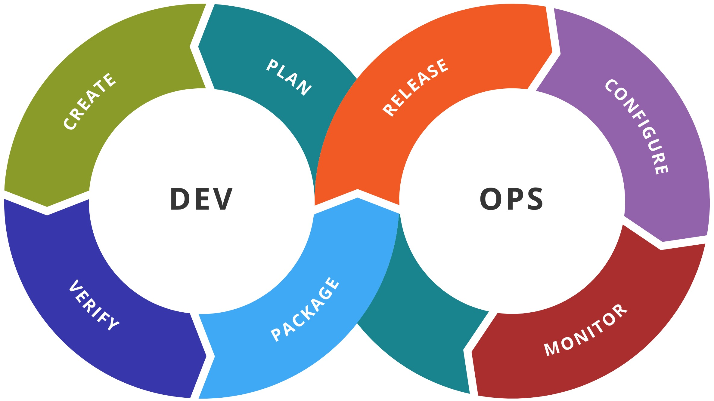

footer: TDO - S01E01
slidenumbers: true
theme: Next, 1

# TDO - S01E01

## DEVOPS

### mercredi 6 septembre @ Prism

---

> Je vous écris une longue lettre parce que je n’ai pas le temps d’en écrire une courte
-- Blaise Pascal

---

> Je vous fais une longue présentation parce que je n’ai pas le temps d’en préparer une courte
-- Peter

---

## Merci

  - au Prism de nous accueillir
  - à la CCISM d'avoir créé le Prism
  - à Maiko de faire la captation vidéo
  - à vous d'être venu
  
---

## Sommaire

  - c'est quoi ?
  - pourquoi ?
  - comment ?
  - l'association Tahiti Devops
  - le programme de l'année

---

## Cette présentation

  - est un fichier [Markdown](https://fr.wikipedia.org/wiki/Markdown)
  - versionné avec [git](https://fr.wikipedia.org/wiki/Git)
  - transformé avec [Deckset](https://www.decksetapp.com)
  - disponible sur github: [source](https://github.com/tahitidevops/devops-presentation/blob/master/tdo_001.md) et [PDF](https://github.com/tahitidevops/devops-presentation/blob/master/tdo_001.pdf)
  
---

## C'est quoi ?

  - Devops = Developer + Operations
  - Une vision motivée par la recherche de la satisfaction de l'utilisateur
  - Une façon de travailler plutôt que des outils spécifiques
  - Un changement d'habitude mais surtout de **CULTURE**
  
[.footer: *c'est quoi* | pourquoi | comment | TahitiDevops]

---

## La/le devops

  - est faillible
  - est humble
  - est partageur de savoir
  - est avide de savoir
  - aime les tests
  - automatise à tire-larigot

---

## On n'a rien inventé

  - [12 factor app](https://12factor.net/fr)
  - [Sur Wikipedia](https://en.wikipedia.org/wiki/DevOps)
  - [Chez Amazon](https://aws.amazon.com/fr/devops/what-is-devops/)
  - [Chez Atlassian](https://www.atlassian.com/devops)
  - [Sélection d'outils sur Github](https://github.com/showcases/devops-tools)
  - [Sur quora](https://www.quora.com/What-is-DevOps)

[.footer: *c'est quoi* | pourquoi | comment | TahitiDevops]

---

## Le processus

  - coder
  - compiler 
  - tester — continuous testing tools that provide feedback on business risks
  - packager
  - déployer
  - configurer
  - surveiller

[.footer: *c'est quoi* | pourquoi | comment | TahitiDevops]

---

---

## Bingo

  - intégration continue
  - livraison continue
  - microservices
  - infrastructure en tant que code
  - gestion de configuration
  - communication et collaboration

[.footer: *c'est quoi* | pourquoi | comment | TahitiDevops]

---

## Intégration continue 1/2

  - lorsqu'on code un logiciel, on inclut des tests (i.e. du code) dont le but est de valider le comportement du logiciel et de détecter des régressions
  - au bout d'un moment, ces tests mettent du temps à être exécutés (plus de 10 min)
  - du coup, on n'hésite à les lancer, ou on n'en lance qu'une partie

[.footer: *c'est quoi* | pourquoi | comment | TahitiDevops]

---

## Intégration continue 2/2
  - solution : déléguer l'exécution des tests à une machine dédiée

[.footer: *c'est quoi* | pourquoi | comment | TahitiDevops]

---

## Livraison continue

  - pour simplifier la livraison, il est commun de définir des dates fixes
  - ainsi, il s'écoule du temps entre la fin d'un développement et la possibilité d'utiliser ce développement
  - solution : livrer dès qu'une fonctionnalité est prête, i.e. en continue

[.footer: *c'est quoi* | pourquoi | comment | TahitiDevops]

---

## Microservices 1/2

  - une application monolithique contient tout le code dont elle a besoin
  - un microservice est une application ne faisant qu'une seule chose (e.g. à partir d'un numéro client et d'un intervalle de temps, renvoyer toutes les factures correspondantes)
  - "l'application" devient la colle qui unit les microservices

[.footer: *c'est quoi* | pourquoi | comment | TahitiDevops]

---

## Microservices 2/2

  - les microservices sont les fonctions métiers qui peuvent être remplacées à la volée

[.footer: *c'est quoi* | pourquoi | comment | TahitiDevops]

---

## Infrastructure en tant que code (IAC)

  - une application a besoin d'une infrastructure pour fonctionner
  - la charge à supporter peut évoluer en fonction du temps
  - les changements d'infrastructure peuvent être coûteux 
  - utiliser du code pour décrire une infrastructure permet de la rendre reproductible

[.footer: *c'est quoi* | pourquoi | comment | TahitiDevops]

---

## Gestion de configuration

  - une application peut nécessiter différents *environnements* (i.e. configurations)
  - ces configurations contiennent des *secrets*
  - il est important de gérer ces configurations, i.e:
    - déployer facilement une application dans un environnement donné
    - sécuriser les secrets

[.footer: *c'est quoi* | pourquoi | comment | TahitiDevops]

---

## Communication et collaboration 1/2

  - des outils de communications et de collaboration tels que l'email, le téléphone ou la réunion ne sont pas tout le temps adapté au besoin de réactivité de la pratique devops
  - des outils de discussions instantanées (Slack, Mattermost, etc...) sont plus efficaces dans certains cas

[.footer: *c'est quoi* | pourquoi | comment | TahitiDevops]

---

## Communication et collaboration 2/2

  - des outils de gestion de code (Github/Bitbucket ou Gitlab) permettent de simplifier la circulation d’informations
  - des outils de monitoring : on peut améliorer ce qu’on peut mesurer

[.footer: *c'est quoi* | pourquoi | comment | TahitiDevops]

—--

## Pourquoi ?

  - tout va plus vite, il faut pouvoir suivre
  - qu'est-ce qui se passe quand une nouvelle personne arrive au service informatique ? (on boarding)
  - qu'est-ce qui se casse si vous le chef de la prod est malade une semaine ? (factor bus)
  
[.footer: c'est quoi | *pourquoi* | comment | TahitiDevops]
  
---

## Onboarding

  - le cas d'une nouvelle employée ou d'un stagiaire
  - combien de temps avant de pouvoir travailler sur le code ?
  - combien de temps pour livrer un correctif en production ?

[.footer: c'est quoi | *pourquoi* | comment | TahitiDevops]

---

## Factor bus

Le facteur bus est une mesure du risque encouru par le non-partage de l'information et de la compétence au sein d'une équipe[^1]

[^1]: http://www.agileadvice.com/2005/05/15/agilemanagement/truck-factor/

[.footer: c'est quoi | *pourquoi* | comment | TahitiDevops]

---

## Comment ?

  - en faisant discuter les devs et les sysadmins
  - en identifiant vos _pain points_
  - en priorisant
  - bla bla bla (aka _call a consultant_)

[.footer: c'est quoi | pourquoi | *comment* | TahitiDevops]
  
---

## L'association Tahiti Devops 1/2

On bootstrap :

  - 4 membres, un site web : [https://www.devops.pf](https://www.devops.pf)
  - promotions de la **diversité** dans l’Informatique (pour commencer)
  - on a pompé les status sur [Framasoft](https://framasoft.org)
  - [degooglisons-internet.org/](https://degooglisons-internet.org/)

[.footer: c'est quoi | pourquoi | comment | *TahitiDevops*]

---

## L'association Tahiti Devops 2/2

  - prochaine AG en ligne pour fixer les cotisations ?
  - beaucoup de conférence plutôt techniques
  - mais pas que… cela dépends aussi de **vous**

[.footer: c'est quoi | pourquoi | comment | *TahitiDevops*]

---

## Le programme 1/3

  - c'est quoi le DevOps (aujourd'hui)
  - Infrastructure as Code
  - Docker : ReX
  - Git
  - Dev Java avec la stack Spring

[.footer: c'est quoi | pourquoi | comment | *TahitiDevops*]

---

## Le programme 2/3

  - Déploiement continu d'un site web statique
  - ChatOps (hubot & co) (edited)
  - HTTP vs. JMS
  - Programmation fonctionnelle
  - Rancher : ReX

[.footer: c'est quoi | pourquoi | comment | *TahitiDevops*]

---

## Le programme 3/3

  - OAuth, OpenId Connect & Co
  - 12 factors apps
  - La diversité dans l'informatique
  - Single Page Application

[.footer: c'est quoi | pourquoi | comment | *TahitiDevops*]

——

## 🤘 Merci 🤘

